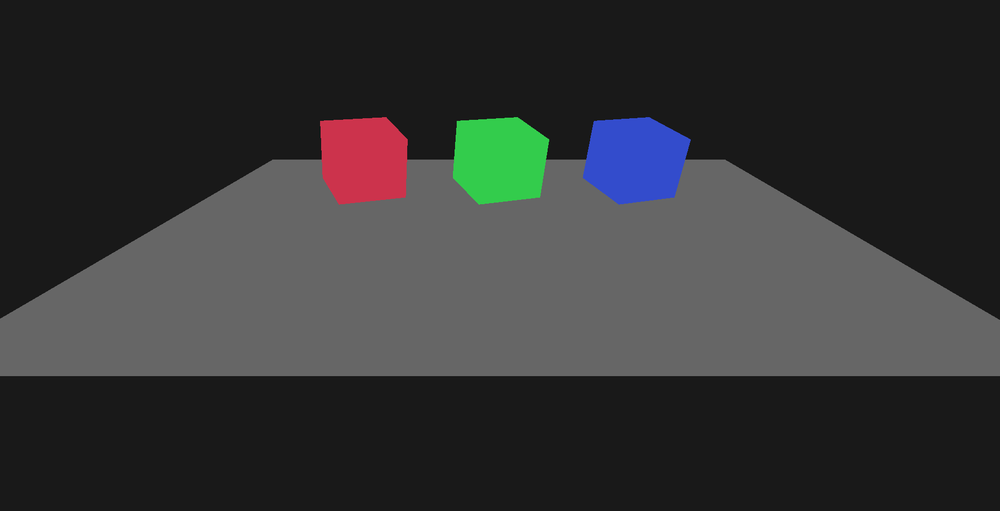

# EEngine

A personal C++ game engine project focused on learning modern engine architecture and graphics programming.

The project originally began as following the **Hazel** engine (from The Cherno’s game engine series) but has since diverged significantly in structure and implementation. The engine now explores modern C++ features, modular architecture, and custom systems built from scratch.

This repository is primarily for **self-education, experimentation, and architectural exploration** rather than production use.

---

## Overview

The engine is a modular C++23 codebase implementing a lightweight rendering framework. It includes both **2D and 3D rendering pipelines**, a **custom entity component system**, and experiments with **modern C++ modules**.

Core goals of the project:

- Learn low-level rendering concepts
- Explore modern C++ language features (C++23)
- Build engine subsystems from scratch
- Experiment with ECS design
- Understand engine architecture and tooling

---

## Key Features

### Modern C++

- **C++23**
- **C++ Modules** for compile-time isolation and dependency reduction
- Heavy use of modern language features where appropriate

### Rendering

- **OpenGL renderer**
- **2D rendering system**
    - sprite batching
    - texture atlases
    - orthographic cameras
- **3D rendering system**
    - mesh rendering
    - perspective cameras

### Engine Systems

- **Custom ECS (Entity Component System)**
    - sparse set component storage model
    - runtime entity management

- **Scene system**
- **Input handling**
- **Window and platform layer**

### Architecture

- Modular engine layout
- Separation between runtime engine code and client/game layer

---

## Technology

- **Language:** C++23
- **Graphics API:** OpenGL (others to follow)
- **Architecture:** modular engine + client layer
- **Build System:** cmake

---

## Current Status

This project is **actively experimental**.

Systems are frequently rewritten as new ideas are explored.

---

## Learning Goals

This engine exists primarily to explore:

- renderer design
- ECS implementation tradeoffs
- modern C++ architecture
- module-based code organization
- engine subsystem boundaries